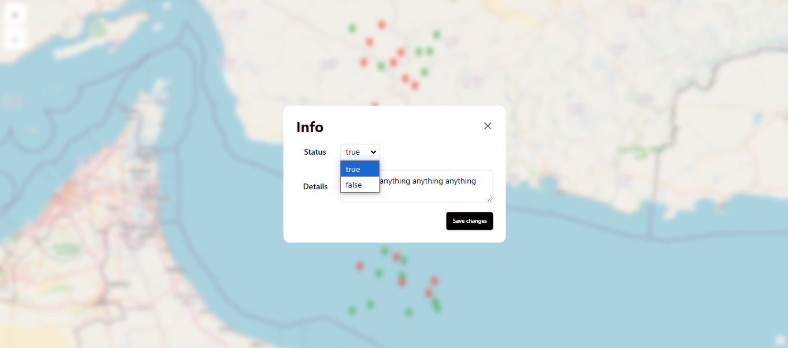

# Map Application

A map application with markers on it containing status and comments. Built with React, Vite.

## Screenshots

### Home Page


### Zoom Control Clicked


### Marker Clicked / Modal Open


### Marker Content Changes



### Responsive Home Page


### Responsive Marker Clicked


## Features

- Map with predetermined markers
- Modal to change marker content
- Zoom in/out buttons
- Offline support with PWA (also for Android/IOS)
- Data persistence through localStorage
- End-to-end testing with cypress
- Responsive design for mobile and desktop

## Getting Started

### Prerequisites

- Node.js
- npm or yarn

### Installation

```bash
git clone https://github.com/omadDB/map-application.git
cd map-application
npm install
```
